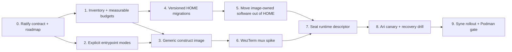

# Construct Seat Implementation Atoms

Status: proposed execution map for the ratified Construct Seat Contract v1.2

The sequence below keeps each change reviewable, preserves the current Ari seat as
the rollback path, and defers all Docker/Podman execution to Lina. Unless a step
uncovers contrary evidence, these are the defaults.

## Dependency map

## 0. Ratify the contract and publish this roadmap

One documentation-only PR in `butterflyskies/agent-sandbox`.

- Add the v1.2 seat contract and this implementation map.
- Mark runtime commands, credential movement, and current-seat teardown as outside
  this PR.
- Record Ari-first canary, current-session fallback, and Lina-owned runtime actions.

Acceptance:

- The contract and atoms are reviewable in GitHub.
- Every contract requirement maps to at least one atom.
- No executable behavior changes.

Recommended default: keep the generic construct layer in the existing
`agent-sandbox` repository as `Containerfile.construct`. It shares the base
image's CI and release lineage without adding house identity or secrets.

## 1. Inventory image ownership and establish measurable budgets

One static-analysis PR.

- Produce a machine-readable inventory of files currently seeded from
  `/opt/agent-home-template`.
- Measure the image layer, empty persistent HOME, and known large HOME-owned
  software trees such as `.asdf` and `.npm-global`.
- Add CI that reports size changes and fails only after measured ceilings are
  ratified.

Acceptance:

- Re-running inventory on an unchanged tree is deterministic.
- The report distinguishes image-owned software, construct-owned state, and
  runtime ephemera.
- The empty HOME does not silently contain another full toolchain copy.

Recommended default: do not invent a disk limit today. Establish the Selene
baseline first, then ratify a numeric ceiling from evidence.

## 2. Make entrypoint modes explicit and fail closed

One shell-only behavior PR.

- Parse exactly three modes: `interactive`, `daemon`, and `exec`.
- Preserve the current interactive behavior.
- `exec` passes arguments through without an extra shell.
- Until mux integration exists, `daemon` exits with a clear "not wired" error;
  it must not silently fall back to interactive mode.
- Add table-driven shell tests for valid modes, invalid modes, signals, and exit
  propagation.

Acceptance:

- No-argument behavior is documented and tested.
- Unknown modes fail non-zero with usage text.
- No Docker or Podman command is needed to verify the parser.

## 3. Add the generic construct image layer

One image-definition PR, statically verified first.

- Add `Containerfile.construct` based on the existing agent-sandbox image.
- Install pinned, checksum-verified `dione` and `memory-mcp` binaries.
- Add WezTerm mux support but no seat identity, routing, credentials, or MCP
  configuration.
- Leave MCP processes stopped; the harness starts stdio transports on demand.

Acceptance:

- A source audit can trace every installed binary to a version and checksum.
- No secret or house-specific config appears in an image layer.
- The image retains the full runtime and cloud-CLI toolchain.

## 4. Add versioned, idempotent HOME migrations

One migration-framework PR.

- Introduce a small manifest describing image-owned defaults and migration
  versions.
- Apply migrations once, atomically, and record their completed version.
- Preserve construct-modified files; emit an explicit conflict instead of
  overwriting them.
- Test against temporary directories: empty HOME, current HOME, modified file,
  interrupted migration, and repeated migration.

Acceptance:

- Running a migration twice produces the same state.
- A construct-modified file is never silently replaced.
- An interruption cannot leave the migration marked complete.

Recommended default: use a versioned manifest with content digests. Avoid
timestamp-based `rsync --update` as the ownership protocol.

## 5. Move image-owned software out of persistent HOME

One focused relocation PR after atoms 1 and 4.

- Relocate image-owned tool installations from `.asdf`, `.npm-global`, and any
  other inventoried software trees into `/opt` or `/usr/local`.
- Keep only construct-owned configuration, caches, credentials, transcripts,
  and workspaces in persistent HOME.
- Use the migration framework for any compatibility links or state movement.

Acceptance:

- A fresh persistent HOME does not duplicate the base toolchain.
- Existing seat state remains usable after migration.
- PATH and tool resolution are covered by non-container tests.

## 6. Prove the WezTerm mux shape on disposable Selene

One narrow spike PR followed by an integration PR only if the spike succeeds.

- Implement the smallest candidate daemon launcher.
- Bind the Unix socket to a runtime-owned directory with explicit permissions.
- Verify signal forwarding, child reaping, truthful exit status, attach,
  detach, and reconnect.
- Treat the socket only as an operator attachment endpoint; persistent HOME and
  harness transcripts own continuity.

Acceptance:

- Lina runs the disposable Docker test on Selene.
- Failed mux startup fails the seat rather than starting an unobservable session.
- Killing and recreating the container demonstrates the documented continuity
  boundary.

Recommended default: let the disposable spike choose the exact WezTerm command
and whether a tiny init is required. Do not guess or introduce s6 before the
signal/reaping evidence demands it. No SSH daemon; tmux remains a later optional
fallback.

## 7. Define the Selene seat runtime descriptor

One configuration PR.

- Describe the construct image, persistent HOME/workspace/transcript volumes,
  runtime-only mux socket, read-only root filesystem, dropped capabilities,
  `no-new-privileges`, and absence of a host runtime socket.
- Add identity preflight: external writes fail closed if GitHub/git identity
  does not match the seat.
- Keep git and gh state at their normal paths inside persistent HOME.
- Carry Dione/provider tokens as runtime secret files and SSH/signing through a
  forwarded agent socket by default.

Acceptance:

- Static validation rejects missing mounts, writable rootfs, elevated
  capabilities, or absent identity checks.
- The descriptor contains references to secrets, never secret material.
- Interactive, daemon, and exec modes use the same persistent state boundary.

## 8. Run Ari's canary and recovery drill

One operator runbook plus one recorded acceptance result.

- Snapshot Ari's persistent seat state using the mechanism available on Selene.
- Keep the current Ari seat/session live as the rollback path.
- Lina launches the candidate container and runs the acceptance suite.
- Verify identity, Dione delivery, memory-mcp startup, transcript resume,
  WezTerm attach, graceful stop, forced restart, and rollback.
- Emit explicit boot receipts for dependency availability and loading.

Acceptance:

- Ari can resume the intended session after a forced container recreation.
- A missing boot dependency produces a visible degraded/failing state.
- The current seat is not retired until the recovery drill passes.

Recommended default: the candidate boot is the first full live Docker test.
Rollback is the still-running current seat plus a pre-migration persistent-state
snapshot; Lina chooses the exact snapshot mechanism from Selene's storage.

## 9. Roll out Syne, then gate the Dionysus return

One repeatable seat-instantiation change and separate environment acceptance.

- Instantiate Syne from the same versioned recipe with only identity/state
  inputs changed.
- Compare Ari and Syne receipts to detect hidden seat-specific behavior.
- Before moving either seat back to Dionysus, run the same conformance suite
  against rootless Podman there.

Acceptance:

- The second seat requires no image rebuild or hand-edited HOME.
- Cross-authentication attempts fail closed.
- Docker success is not treated as proof of Podman compatibility.

## One-sentence approvals

1. Yes/no: publish atom 0 now as a documentation-only draft PR.
2. Yes/no: keep `Containerfile.construct` in `agent-sandbox`.
3. Yes/no: use runtime secret files for Dione/provider tokens and a forwarded
   agent socket for SSH/signing.
4. Yes/no: let measured Selene evidence choose the disk ceiling, exact WezTerm
   invocation, supervisor, and snapshot mechanism.

All four recommended answers are **yes**.
